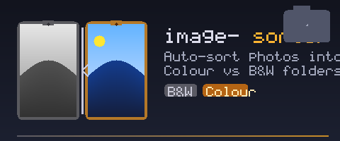

<div align="center">
  

  [](https://www.python.org/)
  [](https://python-pillow.org/)
  [](LICENSE)

  **🖼️ Auto-sort hundreds of photos into colour and black & white folders — one command, zero manual work 🎨**

</div>

---

## ✨ Features

- 🔍 **Automatic detection** — distinguishes colour from black and white images using pixel analysis
- 📁 **Non-destructive** — copies files to the destination, never moves or deletes originals
- 📊 **Progress bar** — live feedback via `tqdm` when processing large folders
- 🖼️ **Format support** — `.jpg`, `.jpeg`, and `.png`

## 🚀 Quick Start

```bash
# Install dependencies
pip install -r requirements.txt

# Sort black and white images
python images_sorter.py --source ./photos --destination ./sorted --type bw

# Sort colour images
python images_sorter.py --source ./photos --destination ./sorted --type colour
```

## 💡 Use Case

You have a folder with hundreds of photos where each image has both a colour version and a black and white version, all mixed together. Manually sorting them would take hours and be error-prone.

This script separates them automatically in seconds.

## 📖 Usage

```
python images_sorter.py --source <path> --destination <path> --type <bw|colour>
```

| Argument | Required | Description |
|---|---|---|
| `--source` | ✅ | Path to the folder containing mixed images |
| `--destination` | ✅ | Path where sorted images will be copied |
| `--type` | ✅ | `bw` for black and white, `colour` for colour |

## 📋 Examples

**Windows:**
```bash
python images_sorter.py --source "C:\Pictures" --destination "D:\Sorted" --type bw
python images_sorter.py --source "C:\Pictures" --destination "D:\Sorted" --type colour
```

**Linux / Mac:**
```bash
python images_sorter.py --source "/home/user/Pictures" --destination "/home/user/Sorted" --type bw
python images_sorter.py --source "/home/user/Pictures" --destination "/home/user/Sorted" --type colour
```

**Relative paths:**
```bash
python images_sorter.py --source ./source_folder --destination ./output --type bw
```

## 🛠️ Requirements

- Python 3.6+
- [Pillow](https://python-pillow.org/) — image processing
- [tqdm](https://tqdm.github.io/) — progress bar

```bash
pip install -r requirements.txt
```
